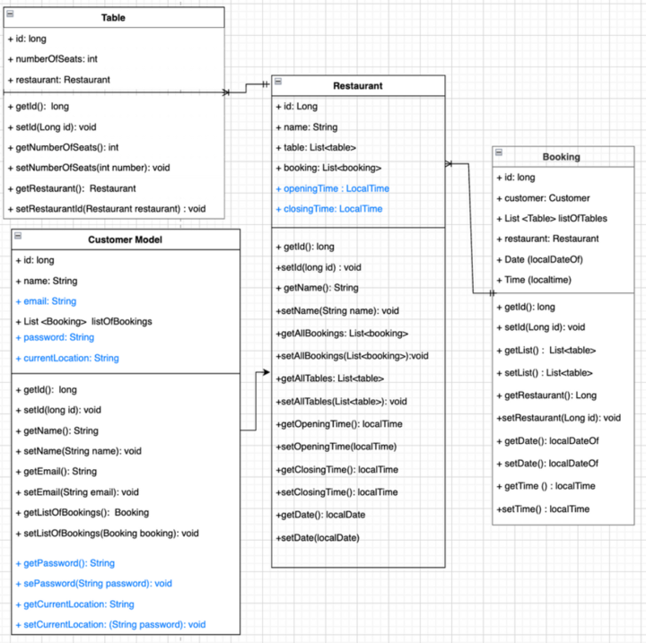
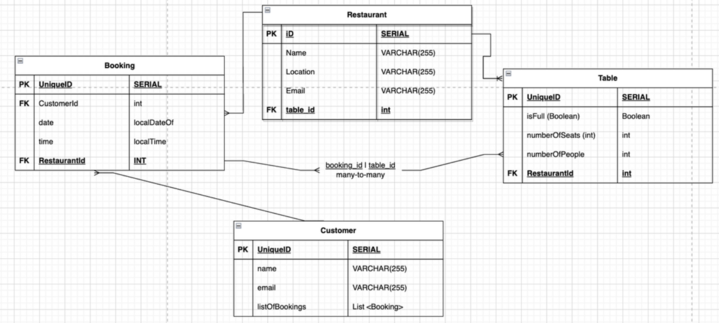

# A RESTAURANT BOOKING APP

### <I>COLLABORATORS: </I>
* Fiona Eshun (GitHub: `Fiona2223` )
* Maryan Axmed (GitHub: `maryan-axmed`)
* Sarah Abdulle (GitHub: `sarahabdulle1`)
* Yasmin Haidar (GitHub: `Yasmin-H` )
* Taliane Moussassa (GitHub: `TalianeM`)

### TABLE OF CONTENTS:

* Project Overview
* Project Aim
* Technical Information
* Installation Guide
* Dependencies
* Diagrams
* The API
* Challenges
* Future

### Project Overview

We collaborated to create the backend of a restaurant booking app that enables a user to book tables at a restaurant of their choice.

Our MVP was to enable a customer to book a table at multiple restaurants and filtering the locations of restaurants by their city. 

### Project Aims

The aim of this project was to make it easier and more convenient for customers to book tables at a restaurant. 

## Technical Information:
Our project utilises the following:
* Spring Boot `version: 3.0.6`
* Maven
* Packaging: `Jar`
* Java `version: 17`
* Dependencies: `Lombok`, `Spring Data JPA`, `Spring Web`, `Spring Boot DevTools`, `PostgreSQL Driver`
* `IntelliJ IDEA JDK 17`, `PostgreSQL`, `Postico` & `Postman` to help create and visualise our code

## Installation Guide:
* Create a local database for the chatroom called `restaurant_booker_db`. In the terminal run: `createdb restaurant_booker_db`

* In `resources.application.properties`, copy the following code :
```
spring.datasource.url=jdbc:postgresql://localhost:5432/restaurant_booker_db
spring.datasource.username=
spring.datasource.password=
spring.datasource.driver-class-name=org.postgresql.Driver
spring.jpa.hibernate.ddl-auto=create-drop

```
* After running the application, you should be able to view the information from the `DataLoader` in Postman and Postico.

### DEPENDENCIES

### DIAGRAMS
#### <i> UML Diagram </i>


#### <i> ERD Diagram </i>


## List of routes:

### Booking Controller
| Route Name                   | Request Type | RequestBody                                                                         | Request Path              |
|------------------------------|--------------|-------------------------------------------------------------------------------------|---------------------------|
| `getAllBookings`             | GET          | null                                                                                | `/bookings`               |
| `getBookingById`             | GET          | null                                                                                | `/bookings/{id}`          |
| `getAllBookingsByCustomerId` | GET          | null                                                                                | `/bookings/customer/{id}` |
| `makeNewBooking`             | POST         | `BookingDTO bookingDTO` (customerName, tableIds, restaurantId, date, time, message) | `/bookings`               |
| `deleteBooking`              | DELETE       | null                                                                                | `/bookings/{id}`          |

### Customer Controller
| Route Name                   | Request Type | RequestBody                        | Request Path                           |
|------------------------------|--------------|------------------------------------|----------------------------------------|
| `getAllCustomers`            | GET          | null                               | `/customer`                            |
| `getCustomerById`            | GET          | null                               | `/customer/{customerId}`               |
| `getCustomerLocationById`    | GET          | null                               | `/customer/{customerId}/location/`     |
| `editCustomerLocation`       | PATCH        | `String newLocation` (newLocation) | `/customer/{customerId}/location/edit` |
| `getAllBookingsByCustomerId` | GET          | null                               | `/customer/{customerId}/bookings`      |
\
### Restaurant Controller
| Route Name                  | Request Type | RequestBody                        | Request Path                  |
|-----------------------------|--------------|------------------------------------|-------------------------------|
| `getAllRestaurants`         | GET          | null                               | `/restaurants`                |
| `getRestaurantById`         | GET          | null                               | `/restaurants/{restaurantId}` |


### Table Controller
| Route Name                   | Request Type | RequestBody                        | Request Path                        |
|------------------------------|--------------|------------------------------------|-------------------------------------|
| `getAllTables`               | GET          | null                               | `/tables`                           |
| `getTableById`               | GET          | null                               | `/tables/{tableId}`                 |
| `getAllTablesByRestaurantId` | GET          | null                               | `/tables/restaurant/{restaurantId}` |


### THE API

### CHALLENGES

### FUTURE